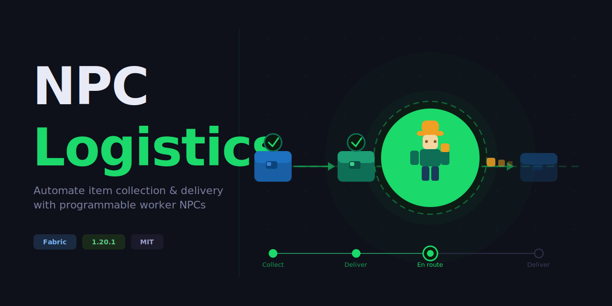

# NPClogistics – NPC Logistics (Fabric 1.20.1)

A Minecraft Fabric mod that adds **Logistics Worker NPCs** capable of executing
item-collection and delivery routes across chests and barrels, and **Role-based autonomous
workers** that perform ongoing jobs — including a **Farmer**, **Shepherd**, **Dairy**, and
**Chicken** role, each running independently with no further player input after setup.

---

## Requirements

| Tool | Version |
|------|---------|
| Minecraft | 1.20.1 |
| Fabric Loader | ≥ 0.15.0 |
| Fabric API | 0.92.6+1.20.1 |
| Java (mod runtime/target) | 17 |
| JDK to **build** | 21 — required to run Gradle / `fabric-loom` 1.13 |

The mod itself compiles to Java 17 bytecode and runs on a Java 17 client/server;
only the Gradle build toolchain needs a JDK 21 present.

---

## Building

```bash
# Gradle must run on a JDK 21 (Loom 1.13 requirement)
JAVA_HOME=/path/to/jdk-21 ./gradlew build
# Output: build/libs/npclogistics-<version>.jar
```

Run the dev client with `./gradlew runClient`.

---

## Project Structure

```
src/
├── main/java/com/npclogistics/
│   ├── NPClogistics.java               # Server entrypoint
│   ├── ai/
│   │   ├── WorkOrderBrain.java         # Tick-based route execution AI
│   │   ├── FarmerBrain.java            # Farmer role state machine
│   │   ├── ShepherdBrain.java          # Shepherd role state machine
│   │   ├── DairyBrain.java             # Dairy role state machine
│   │   ├── ChickenBrain.java           # Chicken role state machine
│   │   └── NightBrain.java             # Night/sleep behaviour
│   ├── command/
│   │   └── WorkOrderCommand.java       # /workorder admin commands
│   ├── data/
│   │   ├── WorkOrder.java              # Core data: route stops, filters, NBT
│   │   └── CraftingTask.java           # Crafting task data
│   ├── entity/
│   │   ├── LogisticsWorkerEntity.java  # NPC entity (inventory, state machine)
│   │   ├── LivestockTaggable.java      # Interface for tagged mob data
│   │   └── ModEntities.java            # Entity type + attribute registration
│   ├── item/
│   │   ├── WorkOrderScrollItem.java    # In-hand tool for recording routes
│   │   ├── LocationTokenItem.java      # Location token item
│   │   ├── LivestockTagItem.java       # Livestock tag item
│   │   └── ModItems.java               # Item registration
│   ├── mixin/
│   │   └── MobEntityMixin.java         # Injects livestock tag data into all MobEntity
│   ├── role/
│   │   └── RoleRegistry.java           # Maps role-tool items to role brain types
│   ├── screen/
│   │   ├── EquipmentScreenHandler.java
│   │   └── ModScreenHandlers.java
│   └── network/
│       └── ModNetworking.java
│
└── client/java/com/npclogistics/
    ├── NPClogisticsClient.java
    ├── client/network/
    │   └── ClientNetworking.java
    ├── renderer/
    │   ├── LogisticsWorkerRenderer.java
    │   └── LivestockCollarRenderer.java # Renders herd-colour collar rings
    └── screen/
        ├── EquipmentScreen.java
        ├── WorkOrderScreen.java
        └── WorkOrderStopFilterScreen.java
```

---

## Items

### Work Order Scroll

The primary tool for recording and assigning delivery routes. Found in the creative
*Tools & Utilities* tab or via `/give @s npclogistics:work_order_scroll`.

### Location Tokens

Five 3D coin-shaped items used to mark locations for roles and crafting tasks.
Each token records a block position when right-clicked on a container, workstation, or any block.

| Token | Colour | Purpose |
|-------|--------|---------|
| **Collect Token** | Blue | Marks the chest/barrel to collect raw materials from |
| **Craft Token** | Amber | Marks the crafting station (crafting table, furnace, etc.) |
| **Deposit Token** | Green | Marks the chest/barrel to deposit finished items into |
| **Jobsite Token** | Red | Centre of a role worker's active job area (farm, pen, etc.) |
| **Bed Token** | White | Bed the worker sleeps in at night |

Tokens are obtained from the creative *Tools & Utilities* tab or crafted in survival.
Right-click a block to record its position into the token; the tooltip shows the stored
coordinates.

### Livestock Tag

A tag that claims an animal to a specific pen location (and herd). Right-click any block
to stamp the pen location into the tag, then right-click an animal to claim it.
Claimed animals are nudged back toward their pen if they stray more than 20 blocks.

**Equipping Work Goggles** while near tagged animals shows a coloured collar ring around
each animal's neck. All animals belonging to the same NPC worker display the same ring
colour; different workers (and different players) get distinct colours.

**Optional: charging a tag with a worker's colour** — right-click an NPC worker with an
unstamped tag before stamping a block. The tag is charged with that worker's herd colour
so any animals you tag manually match the worker's auto-tagged ring colour.

To remove a tag from an animal: **sneak + right-click** with an empty hand.

### Work Goggles

A helmet-slot item that renders route overlays and livestock collar rings for nearby
NPC workers. Overlays render through walls. Craft with 2× Glass Pane + Iron Ingot +
Gold Ingot (shapeless).

#### Crafting recipes (shapeless)

| Item | Ingredients |
|------|-------------|
| Work Order Scroll | Paper + Paper + Feather + Ink Sac |
| Collect Token | Gold Ingot + Lapis Lazuli |
| Craft Token | Gold Ingot + Blaze Powder |
| Deposit Token | Gold Ingot + Emerald |
| Jobsite Token | Gold Ingot + Compass |
| Bed Token | Gold Ingot + Feather |
| Livestock Tag (×4) | Gold Ingot + String |
| Work Goggles | 2× Glass Pane + Iron Ingot + Gold Ingot |
| Logistics Worker Spawn Egg | Egg + Emerald + Iron Ingot |

---

## Obtaining a Logistics Worker

### Survival — Spawn Egg

Craft a **Logistics Worker Spawn Egg** (shapeless: Egg + Emerald + Iron Ingot) and
right-click any solid surface to spawn a worker at that location.
The egg is also available in the creative *Tools & Utilities* tab.

### Creative / Admin — Command

```
/workorder spawn          # spawns a worker at your feet
/workorder spawn <x y z>  # spawns a worker at the given coordinates
```

---

## Gameplay Usage

### Work Order Scroll (delivery routes)

1. Grab a **Work Order Scroll** from the creative *Tools & Utilities* tab.
2. **Right-click** a chest or barrel → adds a **COLLECT** stop.
3. **Sneak + Right-click** a chest or barrel → adds a **DELIVER** stop.
4. **Right-click in the air** → opens the scroll's route in the **Work Order editor**,
   where you can reorder stops, flip COLLECT/DELIVER, and set per-stop item filters.
5. **Right-click** a Logistics Worker NPC → assigns the order; the NPC starts immediately.
6. **Sneak + Right-click** a worker with an empty hand → takes the order back as a fresh
   scroll, leaving the worker idle.

Each container is recorded once — clicking one already on the scroll updates its action
instead of adding a duplicate. The scroll stores the full route including item filters;
filters edited on the scroll carry over to the worker on assignment. The scroll is
consumed on assignment (in creative it is replaced with a blank scroll).

#### Editing routes in the GUI

Open the editor by right-clicking a worker with an empty hand, or by right-clicking in
the air with a Work Order Scroll. Options:

- **Drag any stop row** up or down to reorder it using the `☰` handle; a yellow line
  shows the insertion point.
- **Click `Filter`** on a stop to open the item-filter editor: search the item grid,
  left-click items to add/remove them (green = included). The **"in filter" strip**
  lists everything in the filter — drag an item out or click it to remove it; scroll
  sideways with the mouse wheel when full. An empty filter accepts every item.
  - **Right-click** an item in the strip to cycle its quantity mode:
    **All**, **Stacks** (full stacks only, badge `S`), or **Partial** (non-full stacks, badge `P`).
- **Click the action button** to cycle a stop through **COLLECT → DELIVER → BOTH**.
  A BOTH stop delivers *then* collects in one visit. BOTH stops keep two independent
  filters; the Filter editor shows a **Deliver / Collect** toggle.
- **Scroll the mouse wheel** to page through long stop lists.

---

### NPC Worker GUI

**Right-click** any Logistics Worker NPC with an empty hand to open the worker's
management screen. The screen has four tabs:

#### Equipment tab

Manage the worker's equipped items and identity.

- **Armour slots** — head, chest, legs, feet.
- **Main hand / Off hand** — weapon or tool the worker carries.
- **Order 1 / Order 2** — Work Order Scroll slots. Drop a scroll here to queue a
  delivery route for the worker.
- **Bed Token** — place a stamped Bed Token here to assign the worker a specific bed
  to sleep in each night. Leave empty and the worker will find the nearest bed, shelter
  near a door, or snore in place.
- **Name & Skin** fields — rename the worker and set a custom player-skin URL
  (employer only). Changes apply immediately via the *Apply* button.
- **Employer** label — shows who claimed the worker (top-right corner of the tab).
  An unclaimed worker can be taken by the first player to interact.

#### Orders tab

Displays the work order scrolls currently in the worker's Order slots and summarises
each route (stop count, positions, COLLECT/DELIVER/BOTH actions). Slots are
highlighted in gold if the scroll belongs to another player.

#### Cargo tab

Shows the worker's 18-slot internal inventory (2 rows × 9 slots). Items collected
during delivery runs appear here. Slots are **take-only** — click or shift-click to
retrieve items into your own inventory. You cannot place items into the cargo hold
directly; workers fill it themselves during collection stops.

#### Role tab

Assign an autonomous **Role** to the worker using a three-slot kit:

| Slot | Item | Role activated |
|------|------|---------------|
| **Tool** | Hoe (any tier) | Farmer |
| **Tool** | Shears | Shepherd |
| **Tool** | Bucket | Dairy |
| **Tool** | Feather | Chicken |
| **Jobsite Token** | Stamped Location Token | Centre of the work area |
| **Deposit Token** | Stamped Location Token | Chest/barrel for produce/output |

Once all three slots are filled with valid stamped tokens the status line reads
**"Kit ready — activates on close"**. Close the screen to activate.

The worker's role activates automatically and persists across server restarts via NBT.
To remove a role, open the screen, take the items back out of the kit slots, and close.

The Role tab also has a **Sleep at Night** toggle. When enabled (the default), the worker
stops work at dusk, sleeps, and resumes at dawn. Disable it to keep the worker active
24 hours a day.

#### Tasks tab

Set up **Crafting Tasks** — instructions for the worker to gather materials, craft
items, and store the output.

Each of the 8 task rows has four slots:

| Slot | Token | Meaning |
|------|-------|---------|
| **Collect** | Blue | Where to pick up raw materials |
| **Recipe** | — | The item to be crafted (place the output item here) |
| **Craft** | Amber | The crafting station to use |
| **Deposit** | Green | Where to deliver the finished items |

Place Location Tokens (or the recipe item) in the appropriate slots. Use the
**loop / once** toggle button on each row to set whether the task repeats or runs
once and marks itself complete. The **×** button deletes the row entirely.
Hovering over an empty slot shows a colour-coded hint describing what goes there.

---

### Admin Commands

```
# Spawn a worker (omit coords to spawn at your feet)
/workorder spawn
/workorder spawn <x y z>

# Add stops to the worker's current order (auto-creates one if none)
/workorder addstop <worker> <x y z> collect
/workorder addstop <worker> <x y z> deliver
/workorder addstop <worker> <x y z> both

# Start a named order
/workorder startorder <worker> "My Delivery Route"

# Cancel the active order (worker returns home)
/workorder cancel <worker>

# Check current state
/workorder status <worker>

# Toggle repeating mode
/workorder setrepeating <worker> true
/workorder setrepeating <worker> false

# Remove workers (vanilla /kill with entity selector)
/kill @e[type=npclogistics:logistics_worker]
/kill @e[type=npclogistics:logistics_worker,name="Ol Dave"]
```

---

## Farmer Role

When equipped with a **hoe**, a stamped **Jobsite Token**, and a stamped **Deposit Token**,
a worker operates as an autonomous farmer. No further input is needed after setup.

### What the Farmer does

The farmer runs a continuous state machine driven by a priority scan within **24 blocks**
of the jobsite token's position:

| Priority | Action | Detail |
|----------|--------|--------|
| 1 | **Pick up dropped items** | Collects item entities in the scan radius before doing any crop work |
| 2 | **Harvest mature crops** | Breaks fully grown wheat, carrots, potatoes, or beetroot; replants from inventory in the same tick |
| 3 | **Plant on empty farmland** | Seeds bare farmland blocks when seeds are available |
| 4 | **Till adjacent dirt/grass** | Hoes bare dirt or grass blocks adjacent to existing farmland (within **10 blocks** of the jobsite) |

After a harvest run the worker deposits all produce at the deposit chest, restocks seeds
(up to 16 of each type), then returns to scanning.

### Setting up a farm

1. Place a chest near your farm — this is the **deposit chest**.
2. Stamp a **Jobsite Token** on a block at the centre of the farm area.
3. Stamp a **Deposit Token** on the deposit chest.
4. Open the worker's **Role tab**, place the hoe and both tokens in the three slots.
5. Close the screen — the worker activates immediately.

---

## Shepherd Role

When equipped with **shears**, a **Jobsite Token** (pen centre), and a **Deposit Token**
(wool chest), a worker operates as an autonomous shepherd.

### What the Shepherd does

- Scans within **24 blocks** of the jobsite for adult, unshorn sheep.
- Navigates to each sheep, shears it, and collects the wool.
- When all sheep are shorn (or inventory is full), deposits wool at the chest.
- Waits (~30 s between scans) for wool to regrow before the next round.
- Automatically tags all nearby sheep to the pen on activation; tagged sheep are nudged
  back if they stray more than 20 blocks.
- If no gate is present, navigates directly to the jobsite centre (free-range mode).

---

## Dairy Role

When equipped with a **bucket**, a **Jobsite Token** (near the cows), and a **Deposit Token**
(a chest that acts as both bucket store and milk output), a worker operates as an autonomous
dairy worker.

### What the Dairy worker does

- Takes **empty buckets** from the deposit chest (one per cow to be milked).
- Navigates to each untagged or tagged cow within **24 blocks**, milks it (swaps the
  empty bucket for a milk bucket), plays the milking sound.
- Returns all milk buckets — and any unused empty buckets — to the deposit chest.
- If the chest has no empty buckets, waits 20 s before retrying.
- Automatically tags all nearby cows on activation. MooshroomsX are handled correctly.

---

## Chicken Role

When equipped with a **feather**, a **Jobsite Token**, and a **Deposit Token**, a worker
collects eggs dropped naturally by chickens.

### What the Chicken worker does

- Scans within **24 blocks** of the jobsite for egg item entities on the ground.
- Navigates to the egg, picks it up (and any other eggs within 2 blocks), then deposits
  at the chest.
- Waits 15 s between scans (eggs drop slowly — no point polling faster).
- Automatically tags all nearby chickens on activation.

---

## Night Behaviour

By default, all workers stop at dusk and seek shelter:

1. Navigate to the assigned **Bed Token** position if one is set.
2. Scan for any unoccupied bed within 16 blocks.
3. Navigate 2 blocks inside the nearest door.
4. Snore in place if no shelter is found.

At dawn, workers wake, stand up, and resume their role or delivery route exactly where
they left off.

The **Sleep at Night** toggle in the Role tab disables this so the worker is active 24/7.

---

## Livestock Tags and Collar Rings

**Livestock Tags** claim animals to a pen so that strays are automatically nudged back.
Collar rings (visible through **Work Goggles**) show which herd each animal belongs to —
each NPC worker gets a unique colour derived from their identity, so Dave's flock and
Jones's flock are always visually distinct.

### Tagging workflow

1. **Stamp the tag** — right-click any block to record the pen location. The tag renames
   to `Livestock Tag [x, y, z]`.
2. **Tag an animal** — right-click any sheep, cow, pig, or chicken. The animal is claimed
   and shows a collar ring (visible with Work Goggles).
3. **Untag** — sneak + right-click the animal with an empty hand.

### Matching a worker's herd colour

Right-click the **NPC worker** with an unstamped tag before step 1. The tag charges with
that worker's herd colour (`Livestock Tag [charged]`). Stamp a block, then tag animals as
normal — they will match the worker's ring colour exactly.

Role brains (Shepherd, Dairy, Chicken) auto-tag their animals on activation, so manual
tags are only needed for animals outside the scan radius or when managing mixed herds.

---

## Work Order – Data Model

```
WorkOrder
 ├── id         (UUID)
 ├── name       (String)
 ├── homePos    (BlockPos)  – where NPC returns when done
 ├── repeating  (boolean)   – if true, restarts after completion
 └── stops[]
      └── RouteStop
           ├── pos           (BlockPos)
           ├── action        (COLLECT | DELIVER | BOTH)
           ├── itemFilter    (List<Item>)        – deliver list; empty = accept all
           ├── collectFilter (List<Item>)        – collect list, BOTH only; empty = accept all
           ├── itemModes     (Map<Item,QtyMode>) – per-item quantity rule (absent = ALL)
           ├── collectModes  (Map<Item,QtyMode>) – per-item quantity rule for collectFilter
           └── maxAmount     (int)               – 0 = no limit

QtyMode = ALL | FULL_STACKS (only full stacks) | PARTIAL (only non-full stacks)
```

---

## Extending the Mod

### Adding item filters via code

```java
WorkOrder order = new WorkOrder("Iron Run", homePos, true);

order.addStop(new RouteStop(
    new BlockPos(10, 64, 20),
    List.of(Items.IRON_INGOT),
    StopAction.COLLECT,
    64
));

order.addStop(new RouteStop(
    new BlockPos(30, 64, 20),
    List.of(Items.IRON_INGOT),
    StopAction.DELIVER,
    0
));

worker.startWorkOrder(order);
```

### Replacing art assets

| Asset | Path | Size |
|-------|------|------|
| Work Order Scroll icon | `textures/item/work_order_scroll.png` | 16×16 |
| Worker skin | `textures/entity/logistics_worker.png` | 64×64 skin format |
| Collect Token icon | `textures/item/location_token_collect.png` | 32×32 |
| Collect Token face | `textures/item/location_token_collect_face.png` | 64×64 |
| Craft Token icon | `textures/item/location_token_craft.png` | 32×32 |
| Craft Token face | `textures/item/location_token_craft_face.png` | 64×64 |
| Deposit Token icon | `textures/item/location_token_deposit.png` | 32×32 |
| Deposit Token face | `textures/item/location_token_deposit_face.png` | 64×64 |
| Jobsite Token icon | `textures/item/location_token_jobsite.png` | 32×32 |
| Jobsite Token face | `textures/item/location_token_jobsite_face.png` | 64×64 |
| Bed Token icon | `textures/item/location_token_bed.png` | 32×32 |
| Bed Token face | `textures/item/location_token_bed_face.png` | 64×64 |

Token models use a 3D coin geometry (`models/item/location_token_base.json`): the
`_face.png` texture is mapped to the front and back of the disc; the `_icon.png` is
used as the flat `layer0` fallback.

---

## Changelog

### v1.1.6 (2026-06-27/28)
- **Dairy role:** workers equipped with a bucket milk cows and manage a bucket economy
  (takes empty buckets from the deposit chest, returns milk buckets). MooshroomsX handled.
- **Chicken role:** workers equipped with a feather collect naturally dropped eggs and
  deposit them to the chest.
- **Per-herd collar colours:** each NPC worker's tagged animals display a unique ring
  colour derived from the worker's identity. Animals belonging to different workers are
  visually distinct when viewed through Work Goggles.
- **Charged Livestock Tag:** right-click an NPC worker with an unstamped tag to charge
  it with that worker's herd colour; manually tagged animals then match the worker's ring.
- **Livestock Tag untag gesture:** sneak + right-click an animal with an empty hand to
  remove its tag.
- **Collar rings gated behind Work Goggles:** rings only render while the player has
  Work Goggles equipped in the helmet slot.
- **Mid-path chest avoidance:** pathfinder now prefers routes that don't cross chest or
  barrel lids.
- **Shepherd — no-gate fallback:** if no fence gate is found near the jobsite, the
  shepherd navigates directly to the jobsite centre (free-range mode).
- **Stray enforcement:** threshold reduced from 32 to 20 blocks.
- **Livestock tagging restricted:** Shepherd auto-tags sheep only; Dairy auto-tags cows
  only; manual tags restricted to sheep, cows, pigs, and chickens (rabbits excluded).

### v1.1.5 (2026-06-19)
- **Livestock Tag:** new item (Gold Ingot + String × 4, shapeless). Stamps a pen location,
  claims animals to that pen, and nudges strays back automatically every 5 s.
- **Collar rings:** gold rings render around the neck of all tagged animals when Work
  Goggles are equipped (via `WorldRenderEvents.AFTER_ENTITIES`).
- **MobEntityMixin:** injects `npclogistics_tagged` (synced DataTracker bool) and
  `npclogistics_jobsite` (server-side NBT) into all `MobEntity`.

### v1.3.7 (2026-06-19)
- **Logistics Worker Spawn Egg:** workers can now be spawned in survival via a craftable spawn egg (Egg + Emerald + Iron Ingot, shapeless). Also available in the creative Tools & Utilities tab.
- **Jobsite Token recoloured:** token is now red (was purple).
- **Bed Token recoloured:** token is now white/silver (was light blue).

### v1.3.6 (2026-06-19)
- **Bug — Equipment tab tooltip:** hovering the Order 2 slot incorrectly showed "Bed Token" as the slot label; fixed.
- **Bug — Farmer carrot/potato deposit:** deposit now checks the per-type total across all slots (was per-slot, letting multiple small stacks through).
- **NPC sleeping position:** sleeping offset reduced from 0.25 to 0.1 blocks toward the foot.

### v1.3.5 (2026-06-19)
- **UI — Equipment tab:** Employer label moved to top-right corner.
- **UI — Role tab:** layout fixes for ROLE KIT header and Sleep at Night button.
- **NPC sleeping — correct bed half:** workers resolve the HEAD block of a bed before sleeping.
- **NPC sleeping — headboard offset:** sleeping position shifted 0.25 blocks toward the foot.
- **NPC wake — pose reset:** SLEEPING pose cleared unconditionally at dawn.
- **Bed Token recipe:** Gold Ingot + Feather (shapeless).

### v1.3.4 (2026-06-13)
- **Night behavior:** workers sleep at night by default. Navigate to assigned bed (Bed Token), nearest unoccupied bed, shelter near a door, or snore in place. Wake and resume at dawn.
- **Bed Token:** new white/silver Location Token for recording a worker's personal sleeping spot.
- **`ignoreDark` toggle:** disabling Sleep at Night in the Role tab keeps the worker active around the clock.

### v1.3.3 (2026-06-13)
- **Shepherd role:** workers equipped with shears shear all sheep in the pen, deposit wool, and repeat.
- **WAITING phase:** all role brains have an explicit idle-wait state between work cycles.
- **NPC chest approach:** workers navigate to the side of a chest rather than on top of it.
- **Gate exit fix:** two-stage exit (walk to gate, open, step through) for smooth pen departure.

### v1.3.2 (2026-06-11)
- **Cargo tab polish:** box extended, heading renamed to "Cargo Hold", slot grid indented.

### v1.3.1 (2026-06-11)
- **Immediate work resumption:** worker calls `activateWorkOrders()` on arriving home instead of waiting for the next scheduled window.

### v1.3.0 (2026-06-11)
- **Work Goggles:** renders route overlays (coloured lines, wireframe boxes, billboard labels) and livestock collar rings. Overlays render through walls.
- **Goggle overlay — crafting tasks:** source → craft → deposit triangle in real time.
- **Goggle overlay — idle workers:** configured routes visible even between auto-fire cycles.
- **30% task interleave on repeating routes:** natural side-job cadence without manual scheduling.

### v1.2.0 (2026-06-11)
- **CraftingTaskBrain — batch ingredient collection and loop crafting.**
- **CraftingTaskBrain — arm swing + sound.**
- **Empty source handling:** worker skips home without visiting craft block.
- **Navigation speed:** craft-block nav at 0.8.
- **Survival crafting recipes** for Work Order Scroll and all Location Token variants.

### v1.1.2 (2026-06-11)
- **Farmer arm swing animation** — NPC visibly swings the hoe on harvest, plant, and till.

### v1.1.1 (2026-06-10)
- Hoe held persistently in hand while farmer role is active.
- Batched harvesting — deposits every 6 harvests or when the farm runs dry.
- Item-entity pickup navigates to `y+1`.
- Deposit chest approach from the side.

### v1.1.0 (2026-06-10)
- Farmer role: autonomous harvest → replant → deposit loop.
- Role tab in NPC GUI (Tool + Jobsite Token + Deposit Token kit).
- Idle farm expansion via hoe-tilling adjacent dirt/grass blocks.

### v1.0.0
- Initial release: Work Order Scroll routes, NPC Worker GUI, per-stop item filters,
  drag-to-reorder, BOTH stops, employer system, crafting task stubs.

---

## Roadmap / TODO

### Logistics (Work Order routes)
- [x] GUI: per-stop item filter editor
- [x] GUI: drag-to-reorder stops
- [x] Combined COLLECT + DELIVER at a single stop
- [x] NPC Worker GUI (Equipment / Orders / Cargo / Tasks / Role tabs)
- [x] Worker employer system (claim, rename, skin URL)
- [x] Sounds: chest/barrel open + close sounds
- [x] CraftingTaskBrain: full navigation + crafting execution
- [x] Crafting recipe for Work Order Scroll and all Location Tokens

### Role system
- [x] Role tab in NPC GUI — three-slot kit
- [x] RoleRegistry — extensible role-tool mapping
- [x] Role persists across server restarts via NBT
- [x] Worker drops role kit items on death

### Roles implemented
- [x] Farmer (hoe) — harvest, replant, till, deposit
- [x] Shepherd (shears) — shear sheep, deposit wool, gate management
- [x] Dairy (bucket) — milk cows, bucket economy, deposit milk
- [x] Chicken (feather) — collect dropped eggs, deposit

### Livestock system
- [x] Livestock Tag — claim animals to a pen, nudge strays back
- [x] Collar rings — visible through Work Goggles
- [x] Per-herd colours — each NPC worker gets a unique ring colour
- [x] Charged tags — right-click worker to charge with worker's herd colour
- [x] Untag gesture — sneak + right-click

### Night behaviour
- [x] NightBrain — sleep at dusk, wake at dawn
- [x] Bed Token — personal sleeping spot
- [x] ignoreDark toggle — work through the night

### Polish / future
- [ ] Additional roles: Breeder, Butcher, Miner, Woodcutter
- [ ] Pathfinding: multi-dimension support
- [ ] Sounds: footstep and work-complete sounds
- [ ] Location Tokens: visual beam at stamped position
